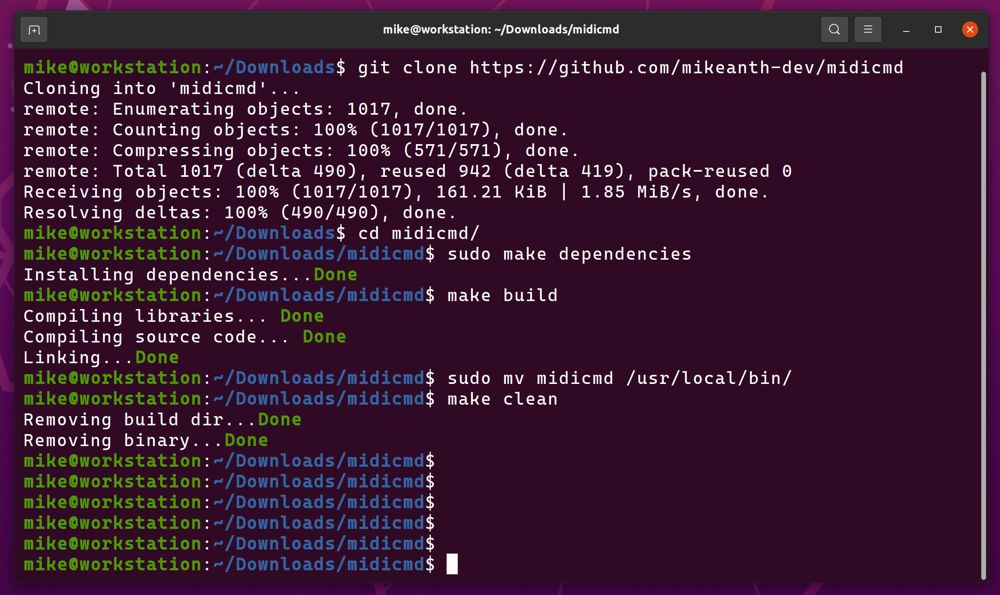
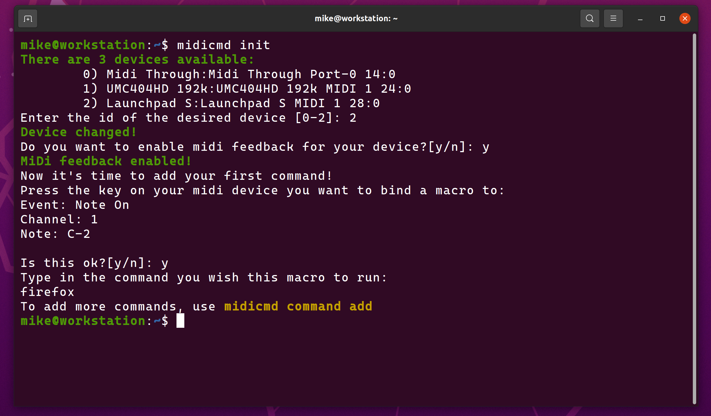

# midicmd


A command-line application that turns any MiDi device into a macro keyboard.

---

## Getting Started

These instructions will get you an instance of the project up and running on your local machine for development or "production" purposes. See the wiki for details on how to use the and further configure the project.

### The easy solution: Getting the precompiled binaries

If you're using an `amd64` based computer, which you most likely are, then the process is relatively simple:

1. Download the latest binary from the releases page:

    ``` bash
    wget https://github.com/mikeanth-dev/midicmd/releases/download/latest/midicmd-amd64 -O ./midicmd
    ```

2. Make sure the file you downloaded is executable:

    ``` bash
    sudo chmod +x midicmd
    ```

3. Finally, make sure that the `midicmd` binary is available on your `PATH`

   To print a colon-separated list of locations in your `PATH`, run `echo $PATH`.  
   Now simply move the `midicmd` binary to one of the listed locations. The following command assumes that `/usr/local/bin` is included in your `PATH` (which it most likely is):

   ``` bash
   mv midicmd /usr/local/bin/
   ```

    For more detail about adding binaries to your path, see this [Stack Overflow article](https://stackoverflow.com/questions/14637979/how-to-permanently-set-path-on-linux-unix).

### Building from source



To compile the `midicmd` binary from source, there are a few more steps, as detailed below.

1. Clone this repository on your local machine

    ``` bash
    git clone https://github.com/mikeanth-dev/midicmd
    ```

2. Navigate to the new directory

    ``` bash
    cd midicmd
    ```

    > Important note:  
    > If you're using a Debian based distro, you have a simpler path ahead of you, since the makefile is built around that.  
    >  
    > If you're using another distro, you will have to look into the `Makefile` yourself and convert the commands as needed.  

3. Install `make` in order to utilize the aforementioned makefile.

    ``` bash
    sudo apt install make
    ```

    > For a turnkey solution, you can stop here and simply run: `sudo make install`.  
    >
    > This command will do the following things:  
    >
    > - install all the required dependencies
    > - compile the code into a binary file
    > - move the compiled binary in `/usr/local/bin`
    > - perform cleanup tasks
    >
    > If you want to install the binary in a different location, keep following this guide.

4. Install the required dependencies

    ``` bash
    sudo make deps
    ```

    This installs the following programs:
      - `g++` in order to compile the code
      - `libasound2-dev` as a dependency required for the code

5. Compile the code into the `midicmd` binary file:

    ``` bash
    sudo make build
    ```

    This is but a wrapper for the `g++` command that build the `*.o` files and links them together.

6. Finally, move the `midicmd` binary in a directory available on your `PATH`

    > This command assumes you don't want to install `midicmd` under `/usr/local/bin`, but rather under `/bin`. Feel free to replace the directory with any other one available in your `PATH`.

    ``` bash
    mv midicmd /bin/
    ```

7. Cleanup the temporary files created by the `build` command

    ``` bash
    make clean
    ```

### The first run

The first time you'll run this program, you should run `midicmd init` to finish setting up your instance.

This does a number of things for you:

- it creates a local service file so that you can enable this program to run as a service for the current user (i.e. start this as soon as you log in)
- it creates a template config file
- it runs you through the absolutely required configuration steps, such as setting up a device, enabling midi feedback and adding your first macro



## Feedback, suggestions and help

For feedback, suggestions, bug reports etc., feel free to e-mail me at 'mike.anth99@gmail.com'.

---

_a project by Mircea-Pavel Anton (Mike Anthony)_
